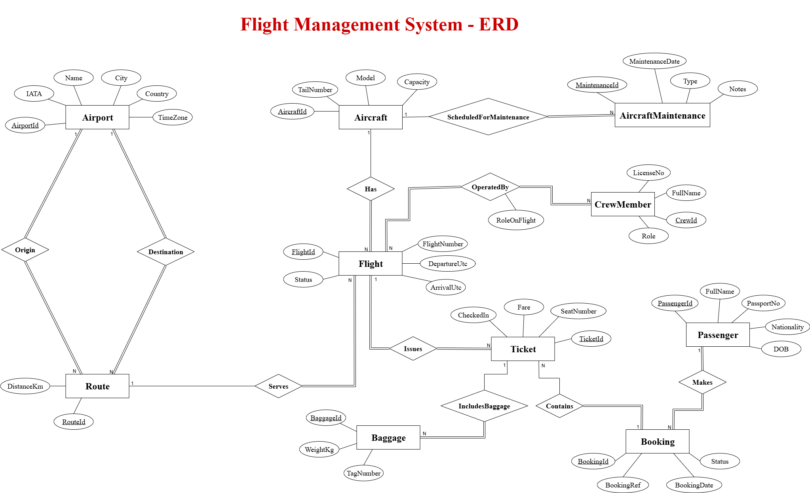
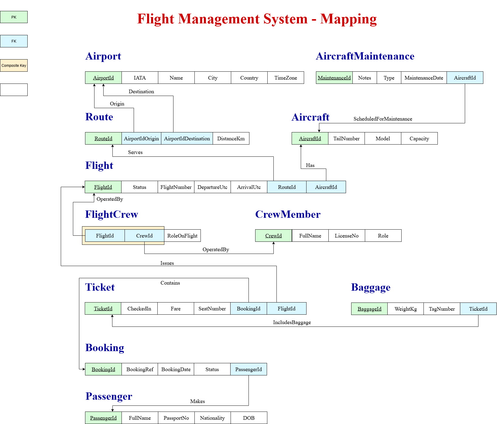

# FlightManagementSystem

## Project Summary (one sentence) 

Build a **Flight Management System (FMS)** backend for a company that manages flights, aircraft, crews, bookings, 
passengers and airports — implemented using **layered architecture, EF Core, Repository pattern**, and **LINQ**. 

## Learning Goals 

- Design and document an ERD and relational schema. 
- Implement EF Core models with annotations and relationships. 
- Implement layered architecture: **Presentation / Service / Repository / Data (DbContext)**. 
- Implement per-entity repositories exposing essential CRUD + query methods. 
- Write LINQ queries: joins, groupings, aggregations, partitioning, projection to DTOs, hierarchical queries 

## Business Domain & ERD (entities + relationships) 

- Airport 
  - AirportId (int PK) 
  - IATA (string, 3, unique) 
  - Name (string) 
  - City (string) 
  - Country (string) 
  - TimeZone (string) 
	
- Aircraft 
  - AircraftId (int PK) 
  - TailNumber (string, unique) 
  - Model (string) 
  - Capacity (int) 
	
- CrewMember 
  - CrewId (int PK) 
  - FullName (string) 
  - Role (enum/string) — Pilot/CoPilot/FlightAttendant 
  - LicenseNo (string, nullable) 
	
- Route 
  - RouteId (int PK) 
  - DistanceKm (int) 
	
- Flight 
  - FlightId (int PK) 
  - FlightNumber (string) — e.g., "FM101" 
  - DepartureUtc (DateTime) 
  - ArrivalUtc (DateTime) 
  - Status (string/enum) 
  ~~Note:~~ add unique constraint on (FlightNumber, DepartureUtc.Date) 
	
- Passenger 
  - PassengerId (int PK) 
  - FullName (string) 
  - PassportNo (string, unique) 
  - Nationality (string) 
  - DOB (DateTime) 
	
- Booking 
  - BookingId (int PK) 
  - BookingRef (string, unique) 
  - BookingDate (DateTime) 
  - Status (string) 
	
- Ticket 
  - TicketId (int PK) 
  - SeatNumber (string) 
  - Fare (decimal) 
  - CheckedIn (bool) 
  - **FlightCrew ➔ relationship attributes on many to many** 
    - RoleOnFlight (string) 
    - Primary Key (FlightId, CrewId) 
	
- Baggage 
  - BaggageId (int PK) 
  - TicketId (FK → Ticket) 
  - WeightKg (decimal) 
  - TagNumber (string) 
	
- AircraftMaintenance 
  - MaintenanceId (int PK) 
  - MaintenanceDate (DateTime) 
  - Type (string) 
  - Notes (string) 

## 1. ERD Solution

## 2. Mapping Solution

## 3. Normalization Solution

### Step 1 — First Normal Form (1NF)

**Becouse of the following reasons, the database is already in 1NF:**
- Each table has a primary key.
- Each column contains atomic values.
- No repeating groups are visible.

**Tables in 1NF:**
- Airport

|AirportId | IATA | Name | City | Country | TimeZone |
|----------|------|------|------|---------|----------|

- Aircraft

|AircraftId | TailNumber | Model | Capacity |
|-----------|------------|-------|----------|

- CrewMember

|CrewId | FullName | Role | LicenseNo |
|----------|----------|------|--------|

- Route

|RouteId | DistanceKm |AirportIdOrigin | AirportIdDestination |
|--------|------------|----------------|----------------------|

- Flight

|FlightId | FlightNumber | DepartureUtc | ArrivalUtc | Status |RouteId | AircraftId |
|---------|--------------|--------------|------------|--------|--------|------------|

- Passenger

|PassengerId |FullName |PassportNo |Nationality |DOB |
|----------|----------|-----------|-------------|-----|

- Booking

|BookingId | BookingRef | BookingDate | Status |PassengerId |
|----------|------------|-------------|--------|------------|

- Ticket

|TicketId | SeatNumber | Fare | CheckedIn |BookingId | FlightId |
|---------|------------|------|-----------|----------|----------|

- Baggage

|BaggageId | TicketId | WeightKg | TagNumber |TicketId |
|----------|----------|----------|-----------|---------|

- AircraftMaintenance

|MaintenanceId | MaintenanceDate | Type | Notes |AircraftId |
|--------------|-----------------|------|-------|-----------|

### Step 2 — Second Normal Form (2NF)

**Becouse of the following reasons, the database is already in 2NF:**
- All non-key attributes are fully functionally dependent on the primary key.
- No partial dependencies exist.
- There are no composite primary keys in the tables.
- All attributes are dependent on the entire primary key.

### Step 3 — Third Normal Form (3NF)

**Becouse of the following reasons, the database is already in 3NF:**
- There are no transitive dependencies.
- All non-key attributes are dependent only on the primary key.

